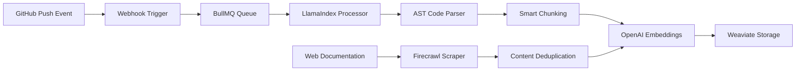
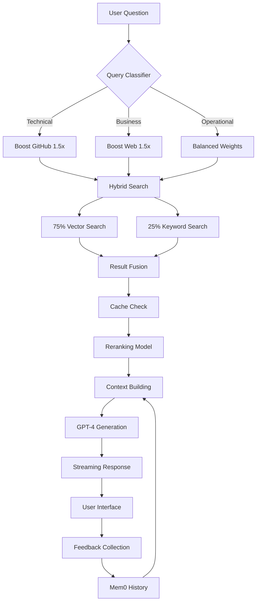

# RAG Agent - AI-Powered Knowledge Assistant

An intelligent knowledge assistant that provides instant, accurate answers from GitHub repositories and web documentation through hybrid search, with zero hallucination tolerance.

## 🎯 Mission

Save 40 engineering hours by building a production-ready RAG agent that unifies code understanding and documentation retrieval across GitHub repositories and web sources.

## 🔄 How It Works

### The Complete Workflow

Our RAG agent operates through two main pipelines:

#### 1️⃣ **Knowledge Ingestion Pipeline** (Building the Knowledge Base)



**What happens when code is pushed:**
1. GitHub webhook notifies our system within seconds
2. BullMQ queues the processing job for reliability
3. LlamaIndex reads the repository and understands code structure using AST parsing
4. Content is intelligently chunked (max 1500 tokens) preserving context
5. Each chunk is converted to a 1024-dimensional vector embedding
6. Vectors are stored in Weaviate with metadata and priority weighting

**Web documentation flow:**
1. Firecrawl scrapes documentation sites weekly
2. HTML is converted to markdown for processing
3. SHA-256 hashing prevents duplicate content
4. GitHub content always takes precedence over web docs

#### 2️⃣ **Query Processing Pipeline** (Answering Questions)



**What happens when you ask a question:**
1. **Classification** - Your question is analyzed to determine if it's technical, business, or operational
2. **Smart Routing** - Different question types prioritize different sources
3. **Hybrid Search** - Combines semantic understanding (vector) with exact matching (keyword)
4. **Caching** - Previously computed embeddings are reused (70% hit rate target)
5. **Reranking** - Cross-encoder model ensures most relevant results appear first
6. **Memory** - Mem0 adds conversation context for follow-up questions
7. **Generation** - GPT-4 creates response with mandatory source citations
8. **Streaming** - Response appears token-by-token for better UX
9. **Learning** - Your feedback improves future responses

## ⚡ Core Features

### Intelligent Capabilities
- **Natural Language Q&A** - Query your entire codebase conversationally
- **Hybrid Data Sources** - Unified search across GitHub repos and web documentation
- **Stealth Mode** - Local repository ingestion with zero production impact
- **Real-time Sync** - GitHub webhooks for instant updates (optional)
- **Source Attribution** - Every answer includes clickable source links
- **Conversation Memory** - Understands context from previous questions
- **Zero Hallucination** - If we don't know, we say so

### Deployment Options
- **🕵️ Stealth Mode** - Local repository cloning and processing (current implementation)
- **🔄 Live Mode** - GitHub webhooks for real-time updates (Week 2+)
- **🌐 Hybrid Mode** - Combine local repos with web documentation

### Performance Guarantees
- Response time: < 2s (p95)
- First token: < 100ms
- Cache hit rate: > 70%
- Query coverage: 95%
- Update lag: < 30s for GitHub, < 1 week for web

## 🛠️ Technology Stack

### Core Infrastructure
- **Framework**: Next.js 14 (App Router) + TypeScript
- **Vector DB**: Weaviate Cloud (Hybrid Search)
- **LLM**: OpenAI GPT-4 Turbo
- **Embeddings**: text-embedding-3-large (1024 dims)

### Processing & Intelligence
- **GitHub Processing**: LlamaIndex (AST-aware parsing)
- **Web Crawling**: Firecrawl (selective scraping)
- **Memory System**: Mem0 (conversation context)
- **Reranking**: cross-encoder-ms-marco-MiniLM-L-6-v2
- **Queue**: BullMQ (async job processing)
- **Cache**: Upstash Redis (embedding cache)

### Monitoring & Operations
- **Error Tracking**: Sentry
- **Analytics**: Vercel Analytics
- **Rate Limiting**: 100 req/min per IP
- **Deployment**: Vercel

## 📦 Quick Start

### Prerequisites
```yaml
Minimum Required (Week 1):
  - Node.js 20+
  - Weaviate Cloud account (14-day free trial)
  - OpenAI API key

Optional Services (Week 2+):
  - GitHub token (for webhook mode)
  - Upstash Redis instance
  - Mem0 account
  - Firecrawl API key
```

### Installation

```bash
# Clone the repository
git clone https://github.com/afoxnyc3/speedboatAgent.git
cd speedboatAgent

# Install dependencies
npm install

# Set up environment variables
# Create .env.local with your API keys

# Test connections
npm run test-weaviate

# Initialize Weaviate schema
npm run setup-weaviate development

# Local ingestion (stealth mode)
npm run ingest-local /path/to/your/repo --dry-run
npm run ingest-local /path/to/your/repo

# Run development server
npm run dev
```

### Environment Configuration

```env
# Core Services (Required for Week 1)
OPENAI_API_KEY=sk-...
WEAVIATE_HOST=https://your-cluster.weaviate.cloud
WEAVIATE_API_KEY=...

# Local Ingestion Mode (Stealth)
LOCAL_REPO_PATH=/path/to/your/repository

# Optional for Week 1
GITHUB_TOKEN=ghp_...
# GITHUB_WEBHOOK_SECRET not needed for local mode

# Infrastructure (Week 2+)
UPSTASH_REDIS_URL=...
UPSTASH_REDIS_TOKEN=...

# Enhanced Features (Week 3-4)
MEM0_API_KEY=...
FIRECRAWL_API_KEY=...

# Monitoring (Production)
SENTRY_DSN=...
VERCEL_ENV=...
```

## 📁 Architecture

### System Architecture
```
┌─────────────────────────────────────────────────────────────┐
│                         USER INTERFACE                       │
│                    Next.js App Router + React                │
└─────────────────────────────────────────────────────────────┘
                                │
                    ┌───────────┴───────────┐
                    │    API GATEWAY        │
                    │   /api/* routes       │
                    └───────────┬───────────┘
                                │
        ┌───────────────────────┼───────────────────────┐
        │                       │                       │
┌───────▼────────┐    ┌────────▼────────┐    ┌────────▼────────┐
│ INGESTION      │    │ SEARCH ENGINE   │    │ CHAT SERVICE    │
│                │    │                 │    │                 │
│ • LlamaIndex   │    │ • Query Class   │    │ • GPT-4 Turbo   │
│ • Firecrawl    │    │ • Hybrid Search │    │ • Streaming     │
│ • Deduplication│    │ • Reranking     │    │ • Mem0 Context  │
└────────────────┘    └────────┬────────┘    └────────────────┘
                               │
                    ┌──────────▼──────────┐
                    │   WEAVIATE CLOUD    │
                    │  Vector + Keyword   │
                    │   Hybrid Database   │
                    └─────────────────────┘
                               │
                    ┌──────────▼──────────┐
                    │   REDIS CACHE       │
                    │  Embedding Cache    │
                    └─────────────────────┘
```

### Project Structure
```
/src
  /app
    /api
      /chat/route.ts          # Streaming chat endpoint
      /ingest
        /github/route.ts      # GitHub webhook receiver
        /web/route.ts         # Web crawl trigger
      /search/route.ts        # Direct search API
      /feedback/route.ts      # User feedback collection
      /health/route.ts        # System status
  /lib
    /ingestion
      /github-processor.ts    # LlamaIndex GitHub ingestion
      /web-crawler.ts        # Firecrawl web ingestion
      /deduplication.ts      # Content deduplication
    /search
      /hybrid-search.ts      # Weaviate queries
      /query-classifier.ts   # Query type detection
      /reranker.ts          # Result reranking
    /cache
      /embedding-cache.ts    # Redis caching
    /memory
      /mem0-client.ts       # Conversation memory
    /weaviate
      /client.ts            # Connection management
      /schema.ts            # Schema definition
  /components
    /chat
      /ChatInterface.tsx    # Main UI component
      /SourceViewer.tsx     # Citation display
      /FeedbackWidget.tsx   # User feedback
```

## 🚀 Implementation Timeline

### Week 1: Foundation ✅ COMPLETE
- ✅ Weaviate schema with hybrid search (11 properties)
- ✅ Local ingestion pipeline via LlamaIndex (477 files processed)
- ✅ Stealth operation mode (zero production impact)
- ✅ Document processing with rich metadata
- ✅ OpenAI embeddings integration (text-embedding-3-large)

### Week 2: Intelligence 🚧
- Query classification system
- Source authority weighting
- Streaming responses with GPT-4
- Source attribution

### Week 3: Hybrid Data 📅
- Firecrawl web ingestion
- Deduplication pipeline
- Source routing optimization

### Week 4: Production 📅
- Mem0 conversation memory
- Feedback system
- Performance optimization
- Monitoring setup

## 📊 Data Sources & Priorities

### GitHub Sources (Priority: 1.2x)
```yaml
File Types:
  - .ts, .tsx (TypeScript)
  - .md, .mdx (Documentation)
  - .json, .yaml (Configuration)

Processing:
  - AST parsing for code understanding
  - Preserves function context
  - Extracts comments and docstrings
  - Real-time updates via webhooks
```

### Web Sources (Priority: 0.8x)
```yaml
Targets:
  - docs.company.com
  - api.company.com
  - help.company.com

Exclusions:
  - /blog/*
  - /careers/*
  - /legal/*

Schedule:
  - Weekly full crawl
  - Daily incremental updates
  - Change detection enabled
```

### Query Routing Logic
```typescript
const queryWeights = {
  'technical': {
    github: 1.5,  // Prefer code for technical questions
    web: 0.5
  },
  'business': {
    github: 0.5,
    web: 1.5      // Prefer docs for business questions
  },
  'operational': {
    github: 1.0,  // Balanced for operational queries
    web: 1.0
  }
}
```

## 🧪 Testing

```bash
# Test Weaviate connection
npm run test-weaviate

# Setup Weaviate schema
npm run setup-weaviate development

# Test local ingestion (dry run)
npm run ingest-local /path/to/repo --dry-run --verbose

# Full local ingestion
npm run ingest-local /path/to/repo

# Run standard tests
npm test
```

## 📈 Success Metrics

### Technical Metrics
- ✅ 95% query coverage from hybrid sources
- ✅ < 100ms p50 vector search latency
- ✅ 0% hallucination rate
- ✅ 70%+ cache hit rate

### Business Metrics
- ✅ 40 engineering hours saved
- ✅ 50% reduction in discovery time
- ✅ 85%+ user satisfaction
- ✅ ROI positive within 60 days

## 💰 Cost Breakdown

| Component | Monthly | Usage | Optimization |
|-----------|---------|-------|--------------|
| OpenAI | $200-400 | Embeddings + GPT-4 | Cache embeddings aggressively |
| Weaviate | $99 | Vector storage | Hybrid search reduces queries |
| Upstash | $10 | Caching layer | TTL policies |
| Mem0 | $49 | Memory system | User-level only |
| Firecrawl | $29 | Web crawling | Weekly schedule |
| **Total** | **$387-587** | | Target -40% via cache |

## 🔒 Security & Reliability

### Security Measures
- GitHub webhook signature verification (HMAC)
- API key rotation via Vercel KV
- Rate limiting (100 req/min per IP)
- Input sanitization with Zod schemas
- No credentials in code

### Reliability Features
- BullMQ for reliable job processing
- Retry logic with exponential backoff
- Dead letter queue for failed jobs
- Health checks and monitoring
- Graceful degradation

## 🚢 Deployment

### Production Checklist
```bash
# Pre-deployment
□ Weaviate schema configured
□ Initial content indexed
□ Cache warmed up
□ Environment variables set
□ Rate limiting enabled

# Deployment
npm run build
npm run test:prod
vercel --prod

# Post-deployment
□ Monitor error rates
□ Check response times
□ Verify cache hit rates
□ Test webhook delivery
```

## 📚 Documentation

- [CLAUDE.md](./CLAUDE.md) - Technical implementation details
- [project-spec.md](./project-spec.md) - Full specification
- [roadmap.md](./roadmap.md) - Development timeline
- [todo.md](./todo.md) - Current sprint tasks

## 🔗 External References

### Core Technologies
- [Weaviate Hybrid Search](https://weaviate.io/developers/weaviate/search/hybrid)
- [LlamaIndex GitHub Reader](https://docs.llamaindex.ai/en/stable/examples/data_connectors/GithubRepositoryReaderDemo/)
- [Firecrawl Documentation](https://docs.firecrawl.dev/)
- [Mem0 SDK](https://docs.mem0.ai/)

### Infrastructure
- [Upstash Redis](https://docs.upstash.com/redis)
- [BullMQ Documentation](https://docs.bullmq.io/)
- [OpenAI Embeddings](https://platform.openai.com/docs/guides/embeddings)

## 🤝 Contributing

1. Check GitHub issues for current tasks
2. Create feature branch: `feature/<issue-id>-<description>`
3. Follow code standards (15-line functions, 100-line files)
4. Ensure tests pass
5. Create pull request

## 📄 License

MIT

---

Built for production-ready knowledge retrieval at scale with zero hallucinations